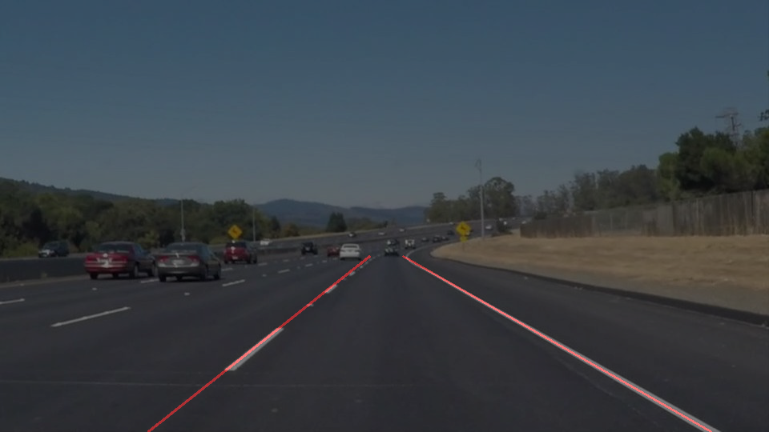

# **Finding Lane Lines on the Road** 
---

### Reflection
In this project the goal was to create a pipieline extracting lane lines from images and drawing them.
Later a video sequence was used to further improve the processing chain.

Example image

Example result

### 1. Pipeline

My pipeline constists of 8 steps

#### STEP 1 Grayscale conversion
#### STEP 2 Color selection (threshold filter)
#### STEP 3 Defining region of interest (ROI)
#### STEP 4 Applying a gaussian blur
#### STEP 5 Detect edges with Canny edge detector
#### STEP 6 Detect lines by Hough transformation
#### STEP 7 Overlay the original image with the detected lines
#### STEP 8 Save the result

In order to draw a single line on the left and right lanes, I modified the draw_lines() function by ...

If you'd like to include images to show how the pipeline works, here is how to include an image: 

explain how you modified the draw_lines() function.

### 2. Shortcoming 

#### SHORTCOMING 1 The maximum number of lines in my algorithm is two. I am only looking for one positive and one negative gradient for the sake of simplicity

#### SHORTCOMING 2 If the curvature is high the line y = m*x+b representation is not well suited

#### SHORTCOMING 3 All this processing is in the image coordinate system and not in the world coordinate system. It's not suited for any controlling for example.

### 3. Suggest possible improvements to your pipeline

#### SHORTCOMING 1 For more complex scenarios I suggest a clustering algorithm (commented in my code)

#### SHORTCOMING 2 I recommend using a different representation like polynomial of order of 2 upwards or even clothoids

#### SHORTCOMING 3 Transform to world coordinate system

